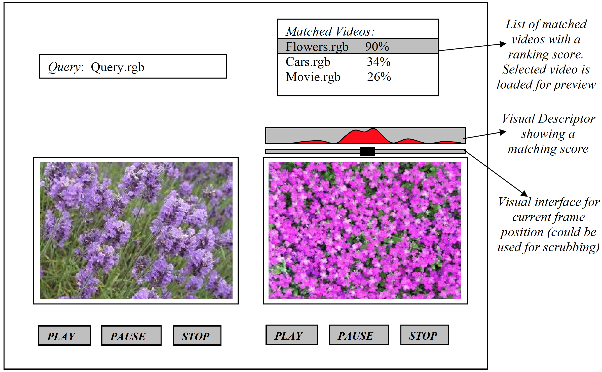

# Fall 2019 CSCI 576 Multimedia Project

The course project is meant to give you an in depth understanding of some of the areas in
multimedia technology. Since this is a broad field, there can be a variety of interesting
projects that can be done depending on your interests which can also extend to related
and complementary topics that are taught in class.

Also, I have often found that a large project can be successfully accomplished via
collaboration. Additionally, working together to design and integrate code can be a
rewarding exercise and you will frequently need to work in teams when you set out to
work in the industry. Accordingly, please form groups of exactly two or at the most three
students. We have started a discussion board to help you make groups, where you may
post your preferred language of implementation, availability etc. Once your group is
decided, please send the TAs an email so we can assign a time for demo on the due date.
If you are a remote student and are having trouble finding a partner, please send an email
to the TA/me and we will try to help. Also, if you are a remote student, we normally
allow you to do a remote demonstration. Details on this will be decided soon.

This semester, I have proposed a project in the area of implementing multimedia queries.
The motivation, description and the expectation for the project follows on the next page.

# Multimedia Queries

Text based searching today has become a natural part of how we access information and
there are many ways to search and rank textual information. For instance, you can search
using a specific text string query while browsing a big text document and just as easily
bring up other documents that contain the same query text string. Search engines like
google, bing, yahoo etc. enable you to search the whole world wide web of textural web
pages for specific strings and rank them in an order of importance using various classes
of search algorithms.

Now with the advances in inexpensive digital video (and audio) capture devices, media
data is commonplace now. There is a lot of digital video information everywhere –
streamed to you via the internet and cable networks, hosted on websites and social media
networks, your own personal hard disks etc. With a lot of video/audio/image information,
there needs to be a search paradigm to make sense of it. However, the search paradigms
and methodologies for media data are as well formed and are still related to text
information and/or metadata that is annotated around the media data.

Rather than using text to query media, another natural paradigm might be to use media
itself – for instance given short video clip, you want to search through an entire database
of videos to find the video which contains the “same” query or “similar” content as in the
query clip. The motivating question here is - what is involved in developing a system that
takes a short video clip as input and very quickly produces a ranked list of videos (from a
database) that either contains the queried short clip or contains similar queried short clips.
This is no doubt a complex problem with many nuances to consider, but a practical and
useful one Although this is a hard problem to solve for all general cases, for the purpose
of this project we will constrain problem space well enough with easier datasets so that
you can get results that should be rewarding.

You will be given a list of video files and corresponding audio files. These will all be the
same image size, same number frames and format. You will need to develop an offline
process that will query these file and extract semantics based on principles that we have
learned in class (or other ideas that you might have). You will need to develop an online
program that will take a short query video (examples will be provided) and create a list of
matched videos which contain the “same” or “similar” query. You will need to develop a
user interface that will show the query video and the list searched videos produced by
your program and play the video/audio upon selection. Consequently, there are three big
parts to this project detailed below

# Offline process to extract video/audio semantics:

This is an offline step that should be run prior to running your query. You can analyze all
the frames of video and audio for every file and extract semantics that will later help you
run a query to index/match. These could be quantitative measures based on concepts
learned in class. There are a few suggestions are listed below, please give thought to how
you would extract them, and organize them to be used for searching.
 Color – For every video you can find a color theme. Eg extracting the most
dominant colors per frame as a list of numbers and collating this information.
 Motion – For every video you can compute motion statistics. Every frame can be
given a quantitative number depending on how much motion you perceive in that
frame.
 Sound – Based on the wave PCM samples, you could compute audio threshold
levels or even frequencies that give allow you to compute a quantitative
assessment of how much sound/frequency there is in an audio segment.

While you may of course use all or some of these descriptors mentioned above, you are
also required to implement an additional descriptor. Please give this thought and
research as needed.

# Querying your database with a clip

This should be a process that takes a short video/audio clip and queries the semantics
generated above. An example invocation might be

MyQuery.exe queryvideo.rgb queryaudio.wav

This should search and create a list of videos that either contain the query media elements
or contain similar elements in a **ranked** order. At end of your search, you should open
and interface to show your results or alternatively you could start you interface and load a
video/audio file to run a query. An example interface is shown below in the next
subsection.

# A/V Player and Query Interface

Design a simple interface that shows the short query video clip and a list of matched
videos that contain the query clip or similar clips in some ranked order. Here are a few
requirements that you need to implement
 You should be able to play, pause and stop the query clip (and it corresponding
audio)
 You should be able to show a list of video files that contain the matched query in
some ranking order. You should be able to select a video from this list and be able
to play, pause and stop the video (and it corresponding audio)
 Additionally, for all selected videos, you should display a visual indicator that
shows you where in the video you found a match with the query clip.

An example of such an interface is shown below, you don’t need to create the exact same
interface, but whatever you create should have the above functionality and allow us to
evaluate your result clearly and easily.

# Expectations and Evaluations:

We do expect that you analyze the problem space and produce a solution. The answers
are subjective (when there is no exact match) depending on what parameters and
descriptors you extract and how you justifiably use them to compute a quantitative
distance measure. Consequently, rather than perceptually making sense, we will be
evaluating if your results match the descriptors you have extracted. Therefore, it is
imperative for you to help the evaluation process by showing a visual description of
where (frames) your video is best matching, why it is matching etc. as in the matched clip
as shown above. You don’t need to create the same interface as shown above, but as long
as it helps us evaluate the correctness of your result, we will be able to assess your
output, even if the output is not entirely correct or consistent
When it comes to playing audio and video, we do expect them to be synchronized.

